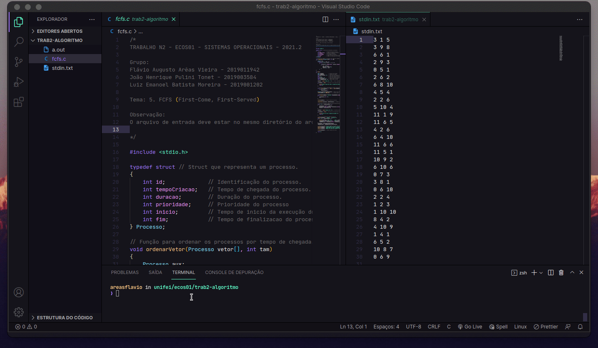

# FCFS - First Come, First Served

Este projeto apresenta uma implementação do algoritmo de escalonamento FCFS
contruído com a liguagem C.

O trabalho compõe requisto parcial da disciplina ECOS01 - Sistema Operacionais
do curso Engenharia de Computação da Universidade Federal de Itajubá.

## Demonstração de funcionamento



## Testar o algoritmo

Clonar o projeto

```bash
  git clone https://github.com/areasflavio/algoritmo-fcfs
```

Ir para a pasta do projeto

```bash
  cd algoritmo-fcfs
```

Um exemplo de entrada `stdin.txt` está presente na pasta do projeto. Se trata de
uma lista de processos, onde cada linha representa um processo e a primeira
coluna representa a data de criação do processo, a segunda coluna representa a
duração do processo e a terceira representa a prioridade do processo, esta última
não é utilizada no algoritmo. 

Compilar o arquivo

```bash
  # Linux
  gcc fcfs.c

  # Windows
  gcc fcfs.c -o fcfs.exe
```

Executar o arquivo de saída

```bash
  # Linux
  ./a.out

  # Windows
  fcfs.exe
```

O resultado será gerado como `stdout.txt` no mesmo diretório do projeto. Apresenta
o diagrama de tempo de execução, o tempo médio de espera, o tempo médio de vida e
a quantidade de troca de contextos ao decorrer da execução.

## Autores

- [Luiz Emanoel](https://www.github.com/em4noel-dev)
- [João Tonet](https://www.github.com/JoaoTonet)
- [Flávio Arêas](https://www.github.com/areasflavio)
